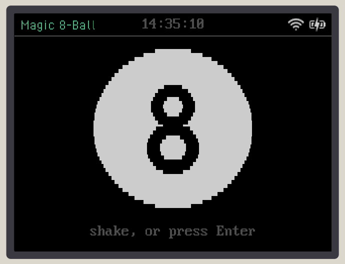
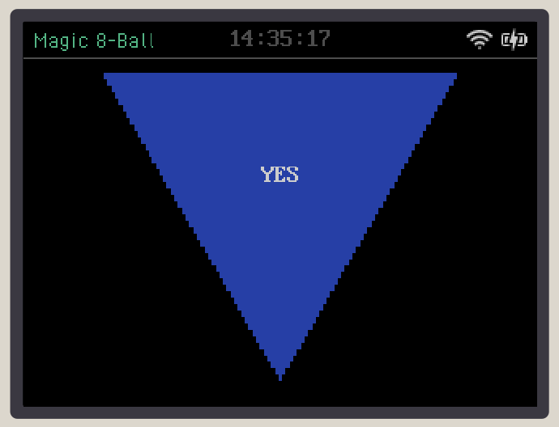

# Badge apps

Apps for the AtomVM conference badge, installed from the badge's Store page.

## Games

| Game | Author | |
|------|--------|-|
| [Magic 8-Ball](apps/magic8) | Luka Dornhecker | Ask a yes-or-no question, shake the badge, and the answer rises out of the ink   |
| [RPS](apps/rps) | Luka Dornhecker | Rock, paper, scissors over IR: point two badges together, pick in secret, face off for a synced reveal  |
| [Snake](apps/snake) | Arjan Scherpenisse | Steer into the food, or press z and watch it play  |
| [Sokoban](apps/sokoban) | Mathias Wingert | Push every box onto a goal, through 20 Microban levels by David W. Skinner   |

## Art

| App | Author | |
|-----|--------|-|
| [Fractals](apps/fractals) | Mathias Wingert | Mandelbrot sectors you zoom into, in five palettes    |

To show pictures, add `apps/<id>/screenshot-<n>.png` and put
`/screenshot-<n>.png" width="200">` in the game's row.

Each app lives in `apps/<id>/`: its code under `lib/`, every module inside
`Badge.App.<Id>`, and its page module `Badge.App.<Id>.Page`. `app.exs` holds
its store entry:

    [name: "Fractals", author: "…", description: "…", version: "1.0.0", storage: "ram", category: "art"]

`id` is a lowercase letter and up to 14 lowercase letters or digits. `name`
is at most 13 bytes, the width of a home grid cell. `category` is one of
`games`, `art`, `music`, `chat`, `tools` or `other`, the Store page's filter;
the list is in `lib/avm_badge_apps/pack.ex`.

## Publishing

This project needs `avm_badge` checked out next to it.

    BADGE_STORE_KEY=~/.config/avm_badge/store_key mix store.pack <id>
    git add packs manifest.json && git commit && git push

Badges see a push within about five minutes. A published version is never
rebuilt with different bytes: bump `version` instead.
